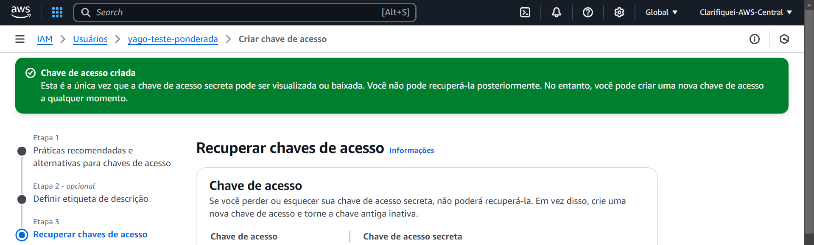
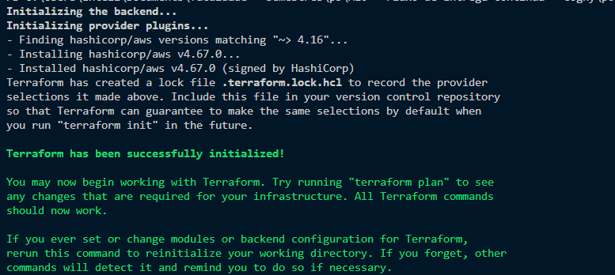
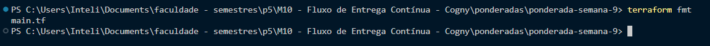
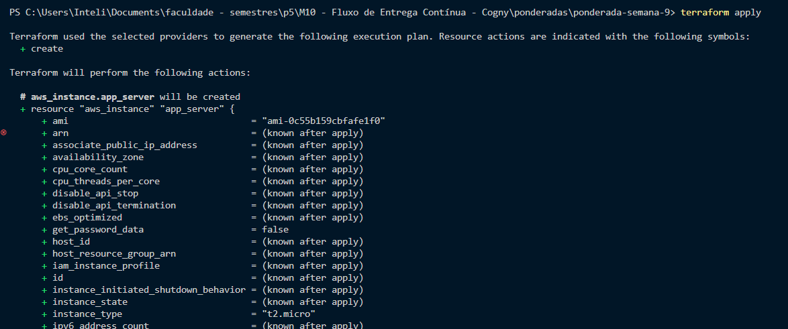
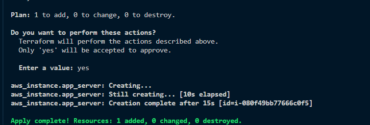
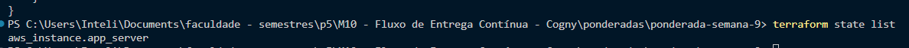

# Ponderada da Semana 9 (Programação - Yago)

## O objetivo dessa atividade é testar a criação do ambiente como IaC - Infraestrutura como Código usando terraform.

* Iremos seguir o tutorial passado para criar o ambiente

## 1. Criação das chaves na AWS 

* Primeiro, entraremos na conta da AWS e usaremos o serviço de IAM para selecionar um usuário e criar a "secret acess key" e a "acess key" com a permissão de administrador



* Criaremos o arquivo ".env" para salvar esses dados

* Rodamos esse comando bash abaixo para salvar as variáveis de ambiente

```bash

Get-Content .env | ForEach-Object {
    $line = $_ -replace '\s+', ''
    if ($line -match '^(.*?)=(.*?)$') {
        [System.Environment]::SetEnvironmentVariable($matches[1], $matches[2], [System.EnvironmentVariableTarget]::Process)
    }
}

```

## 2. Criação do main.tf para definir a infraestrutura

```bash

terraform {
  required_providers {
    aws = {
      source  = "hashicorp/aws"
      version = "~> 4.16"
    }
  }

  required_version = ">= 1.2.0"
}

provider "aws" {
  region  = "us-west-2" 
}

resource "aws_instance" "app_server" {
  ami           = "ami-0044a0897b53acfb6"
  instance_type = "t2.micro"

  tags = {
    Name = "ExampleAppServerInstance"
  }
}
```

## 3. Inicialização

* Para iniciar o arquivo, usaremos o comando: **terraform initi**

* Após isso, teremos esse retorno:



## 4. Formatação

* Para formatação, usaremos o comando: **terraform fmt**

* Após isso, teremos esse retorno:



## 5. Criação da Infra 

* Aplicaremos a infra usando o comando: **terraform apply**

* Após isso, teremos essa saída:



* Ele irá perguntar se está tudo ok e colocando "yes" ele irá criar a infra: 




## 6. Ver o estado atual

* Rodando o comando **terraform show** ele irá mostrar o estado atual:

```bash

# aws_instance.app_server:
resource "aws_instance" "app_server" {
    ami                                  = "ami-0044a0897b53acfb6"
    arn                                  = "arn:aws:ec2:us-west-2:147997134345:instance/i-080f49bb77666c0f5"
    associate_public_ip_address          = true
    availability_zone                    = "us-west-2b"
    cpu_core_count                       = 1
    cpu_threads_per_core                 = 1
    disable_api_stop                     = false
    disable_api_termination              = false
    ebs_optimized                        = false
    get_password_data                    = false
    hibernation                          = false
    host_id                              = null
    iam_instance_profile                 = null
    id                                   = "i-080f49bb77666c0f5"
    instance_initiated_shutdown_behavior = "stop"
    instance_state                       = "running"
    instance_type                        = "t2.micro"
    ipv6_address_count                   = 0
    ipv6_addresses                       = []
    key_name                             = null
    monitoring                           = false
    outpost_arn                          = null
    password_data                        = null
    placement_group                      = null
    placement_partition_number           = 0
    primary_network_interface_id         = "eni-0d4cce029a75a9780"
    private_dns                          = "ip-172-31-23-171.us-west-2.compute.internal"
    private_ip                           = "172.31.23.171"
    public_dns                           = "ec2-54-213-228-39.us-west-2.compute.amazonaws.com"
    public_ip                            = "54.213.228.39"
    secondary_private_ips                = []
    security_groups                      = [
        "default",
    ]
    source_dest_check                    = true
    subnet_id                            = "subnet-079f6f856b3b9a7c2"
    tags                                 = {
        "Name" = "ExampleAppServerInstance"
    }
    tags_all                             = {
        "Name" = "ExampleAppServerInstance"
    }
    tenancy                              = "default"
    user_data_replace_on_change          = false
    vpc_security_group_ids               = [
        "sg-0c89c385bf86f6491",
    ]

    capacity_reservation_specification {
        capacity_reservation_preference = "open"
    }

    cpu_options {
        amd_sev_snp      = null
        core_count       = 1
        threads_per_core = 1
    }

    credit_specification {
        cpu_credits = "standard"
    }

    enclave_options {
        enabled = false
    }

    maintenance_options {
        auto_recovery = "default"
    }

    metadata_options {
        http_endpoint               = "enabled"
        http_put_response_hop_limit = 1
        http_tokens                 = "optional"
        instance_metadata_tags      = "disabled"
    }

    private_dns_name_options {
        enable_resource_name_dns_a_record    = false
        enable_resource_name_dns_aaaa_record = false
        hostname_type                        = "ip-name"
    }

    root_block_device {
        delete_on_termination = true
        device_name           = "/dev/xvda"
        encrypted             = false
        iops                  = 100
        kms_key_id            = null
        tags                  = {}
        throughput            = 0
        volume_id             = "vol-067dbbbb338e0a678"
        volume_size           = 8
        volume_type           = "gp2"
    }
}
```

## 7. Listar recursos do projeto

Rodando o comando **terraform state list**, conseguiremos listar os recursos usados:


